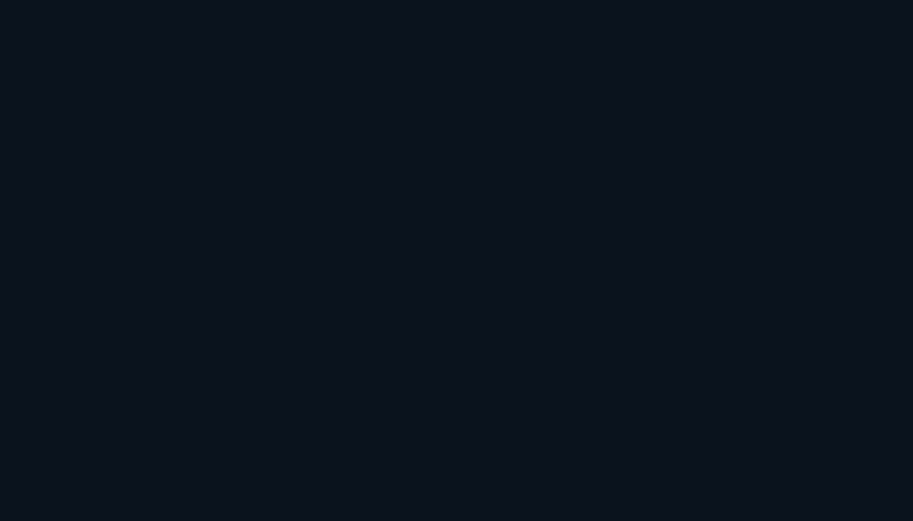

  
### Hey there 

I am and I learn a bit of everything: Student :blue_book:,SysAdmin :computer:,Networks :earth_americas:,Pentester :angel:

📊 My GitHub Stats

 

<b>Note:</b> Top languages is only a metric of the languages my public code consists of and doesn't reflect experience or skill level.
These metrics do not take into account my other repositories hosted by [kyb3rvizsla-others](https://github.com/kyb3rvizsla-others). The top languages is only a metric of the languages my public code consists of and doesn't reflect experience or skill level.

  
🔥 My GitHub Streaks

   
    

Thank you [Fantasmon](https://github.com/spawmc) :heart: